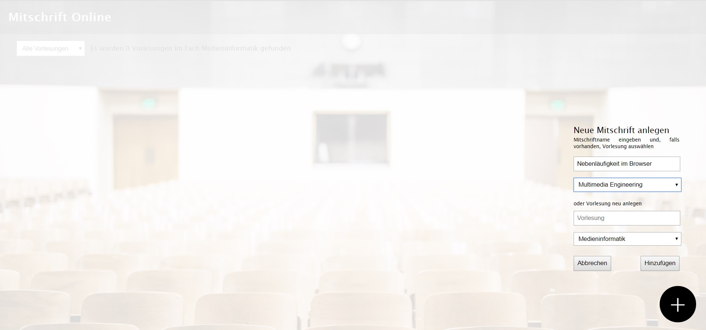
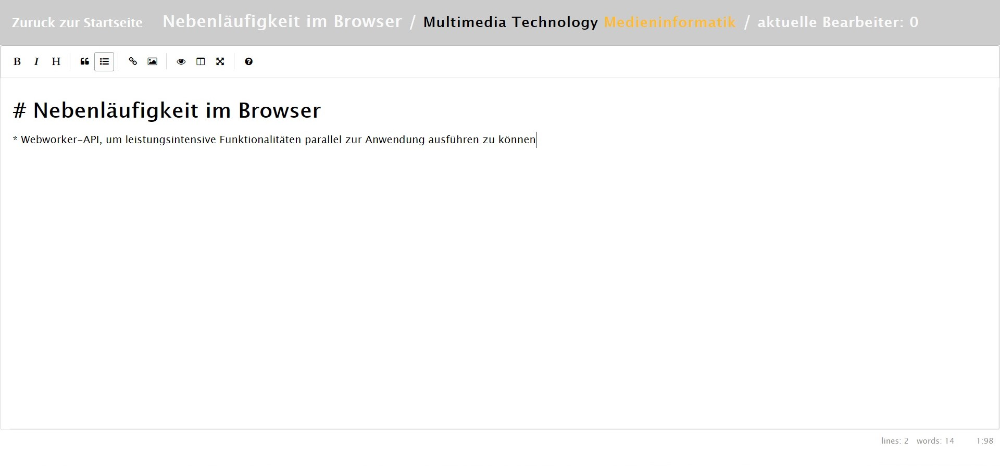

# Projekt

Das Anfertigen von Mitschriften ist zentraler Gegenstand einer jeden Vorlesung der Universität Regensburg. Dabei fertigen die meisten Studierenden bereits ihre Mitschriften digital an, nutzen jedoch nicht die Vorteile, die eine mögliche Kollaboration in der Erstellung dieser digitalen Mitschriften mit sich bringen würde. Dabei ist der mehrheitliche Nutzen kollaborativ online erstellter Mitschriften klar - Studierende können gemeinsam alle wichtigen Aussagen und Inhalten festhalten, dabei verschiedenste Gedanken und Ansichten aller Teilnehmer einarbeiten und so möglichst umfangreiche Mitschriften erstellen. Mitschrift Online ist ein Tool, das diesem gemeinsamen Erstellen von Mitschriften dient. Studierende können gemeinsam an einer Mitschrift arbeiten, diese im Vorlesungsverzeichnis verankert sichern und hinterher wieder in vollem Umfang abrufen. Das Tool dient somit sowohl kurzfristig als auch langfristig, Studierenden Zugang zu möglichst umfassenden Mitschriften zu ermöglichen. 

http://localhost:8000/app/

## Team

| | Infos | Implementierte Komponenten
|-|-|-|
[Foto] | **Miriam Ida Tyroller** E-Mail: miriam-ida.tyroller@ur.de Github-Nutzer: miriamida | Miriam Ida Tyroller hat die Anbindung an die Datenbank implementiert. |
[Foto] | **Felix Kreitmeier** E-Mail: felix.kreitmeier@stud.uni-regensburg.de Github-Nutzer: felice99111 | Felix Kreitmeier hat die Komponente zum kollaborativen und synchronen Editieren einer Mitschrift implementiert. |

## Setup

Localhost: 

1. Führen Sie einen Download des **gesamten** Repositories durch. 

2. Führen Sie **einmalig** den Befehl `npm install` aus, um die notwendigen Abhängigkeiten zu installieren.

3. Führen Sie den Befehl `npm start` aus um die Anwendung zu starten. Der Inhalt des `/app`-Verzeichnis ist anschließend über die die Adresse `http://localhost:8000/app` erreichbar.

4. Möchten Sie die Anwendung kollaborativ nutzen, öffnen Sie die Datei `app/resources/js/client/ClientConfig.js` und ändern dort wie beschrieben den Wert der Konstante `CLIENT-URL`. Die Anwendung ist danach unter `Ihre-WLAN-IPv4-Adresse:8000/app` für alle Nutzer im Netzwerk verfügbar.

## Beschreibung

Im Folgenden sind die Funktionen des Tools gelistet und beschrieben: 

1. Anlegen von Mitschriften - Mitschriften können online erstellt und bearbeitet werden. Dabei werden sie in das existierende Vorlesungsverzeichnis eingeordnet und entweder einer existierenden, oder einer neu angelegten Vorlesung zugeordnet.

2. Kollaboratives Bearbeiten von Mitschriften - mehrere Teilnehmer können gleichzeitig eine Mitschrift bearbeiten.

3. Langfristige Speicherung von Daten - Mitschriften werden inklusive der Metadaten Beschreibung, Erstelldatum, Vorlesung und Modul in einer Datenbank abgelegt und können unbegrenzt abgerufen werden. Die Datenbank kann dabei in der Suchmaske durchsucht werden. 